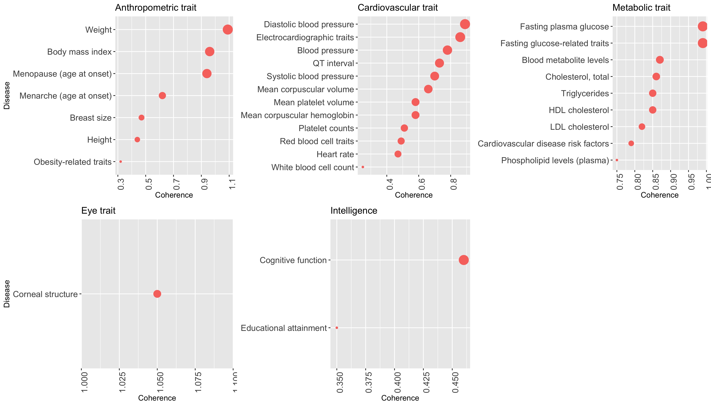
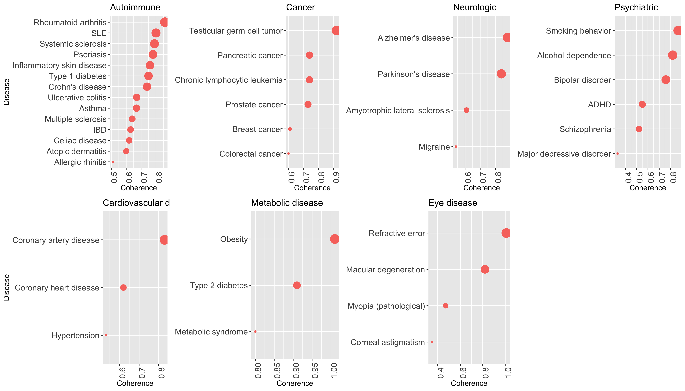

```{r setup, include=FALSE}
knitr::opts_chunk$set(echo = FALSE)
```

##

<center>

</center>

##

<center>

</center>

##

<center>

</center>

##

<center>

</center>

##

<center>

</center>

##

<center>

</center>

##

<center>

</center>

##

<center>

</center>

##

<center>

</center>
